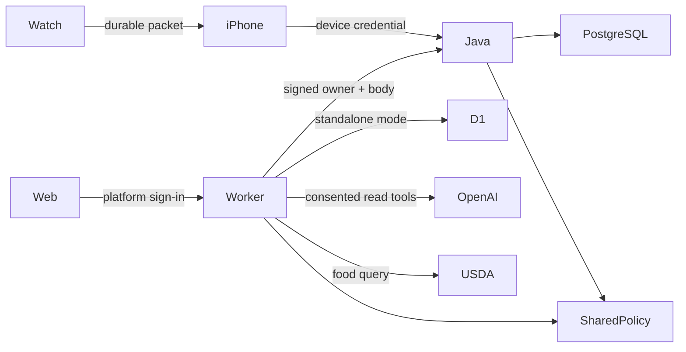

# FitLive architecture

The browser is a React/TypeScript application behind Sites identity. Without Java configuration it persists private account state in D1. With `JAVA_API_URL` and `FITLIVE_BRIDGE_SECRET`, server routes sign requests to Java/PostgreSQL; the browser never receives that secret or supplies an owner identity.

The shared policy is `apps/web/lib/domain.ts` plus `planning.ts`. `scripts/build-policy.mjs` bundles it and its validation dependency into a committed resource. Java executes this trusted bundle through GraalJS with Java/filesystem/network access disabled. User text is passed through bindings as JSON, never evaluated as code. CI regenerates the bundle and fails if the committed resource differs.

Account mutations use a version and operation ID. D1 uses an atomic compare-and-swap batch; PostgreSQL uses a transaction and account row lock. Duplicate operations return the current snapshot. Stale operations return 409. Delete wipes domain data and credentials but retains a blank account/version tombstone to prevent old writes from resurrecting records.

The Java bridge HMAC covers method, path, timestamp, owner and request-body hash, with a 60-second validity window. Native credentials are random, hashed at rest and expire after 90 days. Web-created credentials bind the iPhone to the same `platform:` owner. Optional OIDC access validates issuer and audience; configure it only when needed.

When the Java account is empty, the web can bootstrap from its existing D1 snapshot through a bridge-only route. The destination validates the complete state and never overwrites an existing account. D1 retains the transfer source until retirement; account deletion also clears that legacy domain data. Do not simply disable Java after live writes: reverse migration/restore is required to avoid reverting to stale D1 data.

State remains one bounded JSON document (2 MB) per account. This favors consistent personal-workspace transactions; it is not a claim of unlimited history or large-scale throughput. Rate limits bound mutations and coach requests. Production monitoring, backup/restore verification, hardware tests and measured capacity remain deployment gates.
