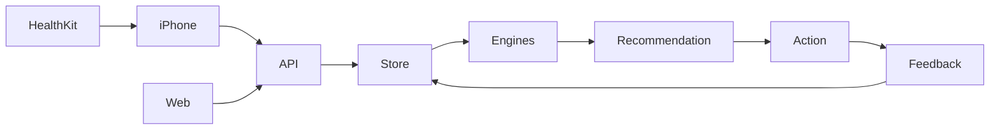

# FitLive architecture

FitLive connects recovery, training, food, pantry and feedback into one daily decision. All authoritative arithmetic and hard constraints are deterministic; optional AI explains allowed actions.

## Delivery architecture

- `apps/web`: React/TypeScript, server routes, authenticated cloud persistence for the hosted personal workspace.
- `backend`: Java 21 / Spring Boot / PostgreSQL deployment option for native clients and independent hosting.
- `apps/ios`: SwiftUI and HealthKit companion, with explicit consent and idempotent ingestion.
- `apps/watch`: focused workout/check-in companion.

Native device signing, HealthKit entitlement, device consent, and independent Java hosting require owner setup. Never describe these as verified until exercised on real hardware. Hosted cloud identity is enforced server-side. Real and demo datasets must be isolated.
