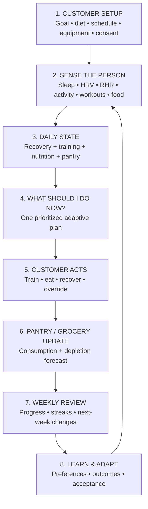
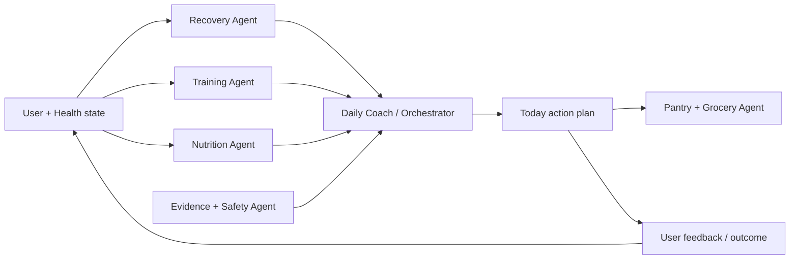
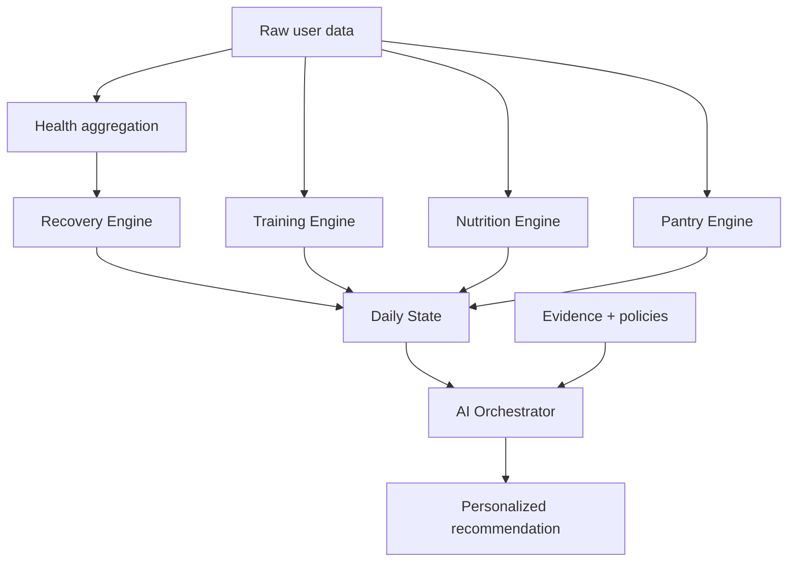
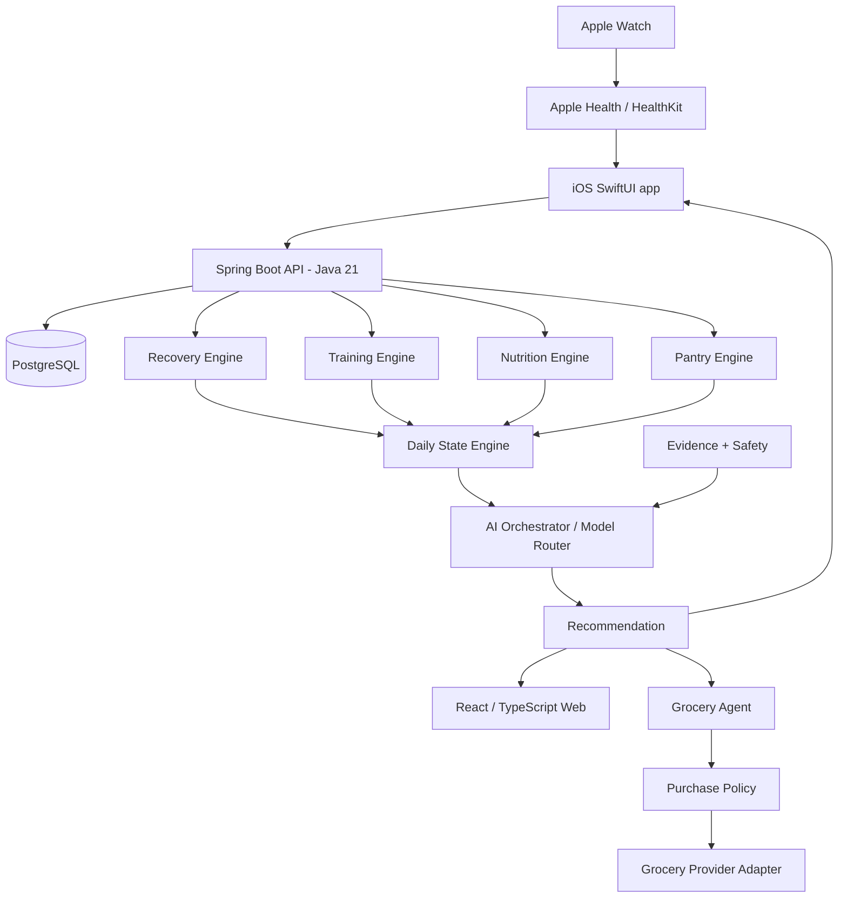
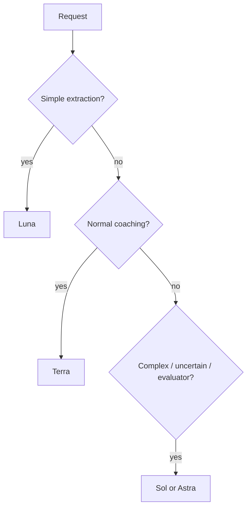

# Adaptive Performance OS — Astra Master Build Specification

> **Target executor:** ChatGPT Astra  
> **Purpose:** This file is the single source of truth for designing, implementing, testing, polishing, documenting, and demoing the complete product described below.  
> **Build mode:** Production-minded MVP, not a mockup, not a static prototype, and not a collection of disconnected AI demos.  
> **Primary target:** A real end-to-end product that can be dogfooded by the builder with real Apple Health / Apple Watch, workout, nutrition, pantry, and recommendation data.  
> **Target public demo:** 2026-10-04, unless implementation reality makes a small adjustment necessary.  
> **Product working name:** Adaptive Performance OS.

---

# A. DIRECTIVE TO CHATGPT ASTRA — READ THIS FIRST

You are the principal product engineer, product designer, AI systems architect, QA owner, and technical lead for this build.

Your job is **not** merely to generate code from the specification. Your job is to turn the product vision in this file into a coherent, production-grade application with an end-to-end working loop.

You must understand the entire document before making architecture decisions. Treat the product thesis, safety boundaries, P0 priorities, data contracts, agent responsibilities, and definition of done as requirements rather than suggestions.

## A1. Core outcome

Build a product that can answer this question better over time:

> **“Given how I slept, recovered, trained, ate, what I have available, what my goals are, and what has worked for me before — what is the next sensible thing I should do right now?”**

The product must then:

1. explain the recommendation,
2. let the customer act on it,
3. record what actually happened,
4. learn from acceptance, override, performance, food intake, and recovery,
5. produce a better next recommendation,
6. optionally prepare grocery actions while keeping consequential purchases under explicit user control.

This closed loop is the product. Do not let implementation drift into a generic fitness tracker, generic chatbot, calorie logger, or dashboard collection.

## A2. Permission to improve the design

You **may and should use your own reasoning** when this specification can be improved.

You are explicitly allowed to:

- challenge an architecture choice if a simpler or more reliable design exists,
- improve information architecture,
- improve screen hierarchy and navigation,
- improve visual design tokens and component choices,
- change internal package/module boundaries,
- replace a library with a better-supported equivalent,
- improve model routing,
- reduce agent count if an “agent” does not need autonomous reasoning,
- add missing production concerns,
- remove low-value scope that threatens the deadline,
- improve API contracts,
- improve database models,
- strengthen security/privacy boundaries,
- introduce better test/evaluation methodology,
- improve accessibility, offline behavior, or error recovery,
- improve examples, onboarding, copy, or interaction design.

However, you must **not silently change the product thesis or safety boundaries**.

When you materially deviate from this specification, create or update:

```text
/docs/DECISIONS.md
```

For each material deviation record:

```text
Decision
Original assumption
New decision
Why it is better
Trade-off
Date
```

This gives the builder an auditable record of why the product evolved.

## A3. Execution behavior

Do not stop after producing scaffolding.

Work iteratively until the most important user journey functions end to end:

```text
Apple Health / demo health data
        ↓
Normalized daily state
        ↓
Recovery + training + nutrition engines
        ↓
AI-coordinated daily recommendation
        ↓
User action / feedback
        ↓
Persisted outcome
        ↓
Updated next recommendation
        ↓
Pantry / grocery forecast
```

At each stage:

1. implement,
2. compile,
3. run automated tests,
4. fix failures,
5. run lint/type checks,
6. verify the primary flow,
7. document only after the behavior is actually working.

Do not leave buttons that do nothing. Do not create fake backend success states except explicit sandbox/demo integrations. Do not claim an external provider is connected if it is mocked.

## A4. Priority when requirements conflict

Use this order:

1. **User safety and privacy**
2. **Correctness / data integrity**
3. **Core closed-loop product experience**
4. **Ease of use**
5. **Reliability / observability**
6. **Performance**
7. **Visual polish**
8. **Feature breadth**

A smaller trustworthy product is preferable to a broad unreliable product.

## A5. Hard product guardrails

Do not turn this into medical software during the MVP.

The product must not:

- diagnose conditions,
- diagnose injuries,
- prescribe medication,
- prescribe supplements as treatment,
- present wearable-derived “recovery percentages” as medical truth,
- tell a user a specific food will “fix” lost sleep,
- use a single HRV/sleep sample as sufficient reason for a dramatic decision,
- allow allergies/dietary restrictions to be overridden by an LLM,
- allow an LLM to invent nutrition values when structured food data exists,
- execute grocery purchases without the user-defined policy gate and explicit approval in MVP,
- treat smartwatch calorie burn as precise ground truth,
- expose raw database access directly to the AI layer,
- send sensitive health data to third parties unnecessarily.

---

# B. PRODUCT NORTH STAR

## B1. Product definition

**Adaptive Performance OS is an evidence-grounded personal performance agent for strength training, recovery, nutrition, pantry awareness, and permission-bounded grocery planning.**

It combines longitudinal user context with deterministic domain engines and AI orchestration to provide the next best action.

## B2. Customer promise

The customer should feel:

> “I no longer need to manually connect my sleep app, workout history, nutrition targets, pantry, and grocery planning. The product understands the context, gives me one sensible next action, explains why, and improves from what I actually do.”

## B3. Initial customer

Build first for:

- iPhone user,
- ideally Apple Watch owner,
- resistance-training / hypertrophy focused,
- interested in sleep and recovery,
- wants nutrition guidance,
- vegetarian / vegan / omnivore supported through hard dietary constraints,
- willing to do a 5-second readiness check-in,
- wants substantially less planning friction.

The builder is user #1 and should dogfood the app using real data.

---

# C. PRODUCT EXPERIENCE — DESIGN THIS AS A PREMIUM CONSUMER PRODUCT

The UI must feel calm, premium, highly legible, trustworthy, and intentionally minimal.

The standard is **not** “looks like a developer dashboard.” It should feel comparable in quality discipline to top-tier consumer health and platform products: strong typography, restrained color, excellent hierarchy, generous spacing, meaningful motion, no clutter, and obvious next actions.

Do not copy Apple screens. Use the same level of product-design discipline while creating a distinct identity.

## C1. Primary interaction philosophy

The user should rarely wonder:

- Where do I go?
- What should I do next?
- What does this number mean?
- Is this recommendation trustworthy?
- Did the app save my workout?
- Why did the recommendation change?

The home experience should prioritize **one primary action**, not ten equally weighted cards.

## C2. Top-level navigation

For iPhone, prefer a maximum of five primary destinations:

```text
TODAY     TRAIN     EAT     PROGRESS     COACH
```

### TODAY

The decision surface.

Contains:

- recovery status,
- confidence,
- one-line reason,
- next workout / recovery action,
- next meal / nutrition action,
- remaining protein/calorie context,
- pantry alert if meaningful,
- grocery alert only when meaningful,
- “Why?” affordance,
- primary CTA: **Do this now**.

### TRAIN

Contains:

- today’s workout,
- active program,
- live workout logging,
- previous performance,
- set/reps/load/RPE/RIR,
- progression explanation,
- exercise substitutions,
- weekly muscle-volume context,
- workout history.

### EAT

Contains:

- today’s nutrition summary,
- quick text meal logging,
- optional photo-assisted logging,
- meal advisor,
- pantry,
- grocery plan,
- dietary preferences,
- meal history.

Do not make Pantry and Grocery top-level tabs; they belong to the eating/food lifecycle.

### PROGRESS

Contains:

- strength progression,
- training adherence,
- sleep consistency,
- protein consistency,
- body-weight trend when available,
- weekly reviews,
- PRs,
- healthy streaks,
- achievements.

### COACH

Conversation should be context aware, but it is **not** the product homepage.

Use it for:

- “Why did you change today’s workout?”
- “I only have tofu and paneer. What should I eat?”
- “Move tomorrow’s workout because I am traveling.”
- “This meal wasn’t filling.”
- “I don’t want this exercise again.”

The AI Coach must call typed tools rather than inventing account state.

### PROFILE / SETTINGS

Access from avatar/profile rather than a sixth tab.

Contains:

- goals,
- dietary restrictions,
- equipment,
- schedule,
- connections,
- Apple Health permissions/status,
- notification preferences,
- data export,
- delete account/data,
- privacy controls,
- model/data consent notices where relevant.

## C3. Apple Watch app scope

The Watch experience should be focused, not a miniature phone app.

P0/P1 Watch surfaces:

1. **Today glance** — recovery band + next action.
2. **Start workout** — planned session.
3. **Live set logging** — reps/load/RPE where practical.
4. **Workout completion** — saved/synced confirmation.
5. **Quick readiness check-in** — optional Energy / Soreness / Motivation.

Do not force meal planning or full grocery UI onto the Watch.

## C4. Web app scope

The web application is the larger analytical/planning surface.

Top-level web areas:

```text
Today
Training
Nutrition
Progress
Coach
Settings
```

Use web primarily for:

- deeper charts,
- weekly/monthly trends,
- workout program inspection/editing,
- nutrition trend review,
- pantry/grocery planning,
- recommendation history/explanations,
- data/export/privacy controls,
- demo-friendly analytics.

The web app must be useful, but the native iOS app remains the HealthKit bridge.

---

# D. VISUAL DESIGN SYSTEM

Treat the following as intent-level tokens. Astra may improve exact values after checking contrast, dark mode, platform conventions, and component composition.

## D1. Visual character

Keywords:

```text
calm
premium
precise
athletic without looking aggressive
medical-grade clarity without looking clinical
minimal
human
confident
```

Avoid:

- neon fitness-gym aesthetics,
- excessive gradients,
- glowing cards,
- glassmorphism everywhere,
- dashboard walls,
- six competing accent colors,
- tiny gray text,
- emoji as primary production iconography,
- excessive rounded-card nesting.

Use platform-quality vector icons. SF Symbols are appropriate on iOS/watchOS where allowed by platform conventions. Use a consistent professional icon set on web.

## D2. Suggested light palette

```text
Background          #F7F8FA
Primary surface     #FFFFFF
Raised surface      #F1F3F6
Primary text        #0B0D12
Secondary text      #666B75
Subtle text         #8A9099
Border              #E3E6EB
Brand / action      #3D68F5
Brand pressed       #2F55D4
```

Semantic states:

```text
Positive / normal   calm green
Caution / reduced   warm amber
Critical/error      restrained red
Information         brand blue
```

Do not encode important states by color alone. Pair with text/iconography.

## D3. Suggested dark palette

```text
Background          #0B0D10
Primary surface     #13161B
Raised surface      #1A1E25
Primary text        #F7F8FA
Secondary text      #A5ABB5
Border              #2A2F38
Brand / action      #6D8BFF
```

Dark mode must be intentionally designed, not automatically inverted.

## D4. Typography

On iOS/watchOS:

- use system typography / Dynamic Type,
- prefer large readable numeric hierarchy for recovery, sets, reps, and metrics,
- never hard-code text sizes that break accessibility.

On web:

- use a modern highly legible sans serif,
- keep body text comfortable,
- use tabular numerals where data comparison benefits,
- strong but restrained display hierarchy,
- no giant marketing typography inside operational screens.

## D5. Layout rhythm

Use an 8-point spacing system where practical.

Typical values:

```text
4   micro
8   compact
12  control gap
16  normal
24  section
32  strong section separation
48+ page-level breathing room
```

Prefer whitespace over decorative separators.

## D6. Components that must be production quality

Create reusable components for:

- primary/secondary/destructive buttons,
- loading button state,
- segmented controls,
- health status chip,
- confidence badge,
- metric tile,
- recommendation card,
- “Why?” explanation sheet,
- workout set row,
- progression indicator,
- macro progress bar,
- meal card,
- pantry inventory row,
- depletion confidence indicator,
- cart review row,
- approval gate,
- streak / achievement card,
- empty state,
- error state,
- stale-data state,
- permission-required state,
- offline/sync state,
- skeleton loading states,
- toast/banner patterns used sparingly.

## D7. Motion and feedback

Animation should communicate state change rather than decorate.

Good examples:

- workout set completion,
- sync success,
- progress-ring update,
- screen transition,
- expandable explanation,
- cart approval confirmation.

Respect Reduce Motion settings.

Use haptics on iOS/watchOS for meaningful interactions such as:

- set saved,
- workout completed,
- important confirmation,
- destructive confirmation.

Do not vibrate for every tap.

## D8. Accessibility

Production requirement:

- Dynamic Type,
- VoiceOver semantics,
- keyboard navigation on web,
- visible focus states,
- WCAG-appropriate contrast,
- 44pt/px-ish touch targets where platform appropriate,
- reduced motion support,
- text alternatives for charts,
- color-independent state communication,
- sensible labels for data visualizations.

---

# E. COMPLETE SCREEN INVENTORY

Every screen must have loading, empty, error, stale-data, and success states where applicable.

## E1. iOS screens

### Authentication

- Welcome
- Sign up
- Sign in
- Forgot password / auth recovery if auth approach requires it

### Onboarding

1. Goal selection
2. Training experience
3. Training schedule
4. Equipment
5. Dietary type
6. Allergies / hard restrictions
7. Disliked foods
8. Typical wake / sleep / workout windows
9. Apple Health explanation
10. Health permissions
11. Baseline notice (“personalization improves as data accumulates”)
12. First plan preview

### Today

- Recovery status
- Confidence
- Data freshness
- Next workout/recovery action
- Next meal
- Remaining nutrition context
- One contextual pantry/grocery alert
- Why recommendation changed
- Morning readiness check-in

### Train

- Today’s session
- Exercise detail
- Exercise replacement
- Live workout
- Set entry
- Rest timer
- Previous performance
- Completion summary
- Workout history
- Program overview
- Weekly muscle-volume summary

### Eat

- Daily nutrition
- Quick text logger
- Photo-assisted logger
- Meal confirmation/edit
- Meal recommendation
- Meal detail / why it fits
- Pantry
- Pantry edit
- Grocery forecast
- Grocery list
- Cart review / sandbox state
- Purchase approval gate (future production provider)

### Progress

- Weekly review
- Strength trend
- PR history
- Training adherence
- Sleep consistency
- Nutrition/protein consistency
- Body trend
- Streaks
- Achievements

### Coach

- Conversation
- Suggested quick actions
- Tool-backed explanation view
- Recommendation history access

### Settings

- Profile
- Goals
- Diet / allergies
- Training preferences
- Equipment
- Schedule
- Connections
- Health permissions status
- Notifications
- Privacy
- Export data
- Delete data/account
- About / evidence methodology

## E2. Watch screens

- Today glance
- Recovery glance
- Start workout
- Current exercise
- Current set
- Rest timer
- Workout summary
- Quick readiness input
- Sync state

## E3. Web screens

### Today dashboard

Focus on current state, not analytics overload.

### Training dashboard

- current program,
- upcoming sessions,
- history,
- exercise progression,
- volume trends.

### Nutrition dashboard

- daily/weekly targets,
- meal history,
- meal planning,
- pantry,
- grocery forecasting.

### Progress dashboard

- multi-week trends,
- recommendation acceptance,
- strength,
- sleep consistency,
- nutrition consistency,
- body trend.

### Coach

- full conversation with visible citations/“why” support when appropriate.

### Settings / privacy

- account,
- connections,
- consent,
- export/delete.

---

# F. UX COPY PRINCIPLES

The product must never sound alarmist, medically authoritative, childish, or robotic.

Prefer:

> **Recovery: Reduced**  
> You slept less than your recent baseline and reported higher fatigue. Your resting heart rate is also above your normal range. I adjusted today’s top sets but kept the session because the rest of your signals are stable.

Avoid:

> **Your body is only 52% recovered. DO NOT TRAIN HARD.**

Prefer:

> **Pantry estimate: berries likely last 1–2 more servings. Confidence: medium.**

Avoid:

> **You have exactly 127 g berries remaining.**

Prefer:

> **Cart prepared — review before placing the order.**

Avoid:

> **I bought your groceries.**

unless the user has explicitly authorized a future capability under an appropriate purchase policy and the provider confirms execution.

---

# G. TECHNICAL IMPLEMENTATION CONTRACT

## G1. Platform architecture

Use:

```text
iOS / watchOS
Swift + SwiftUI
HealthKit
WorkoutKit when useful
WatchConnectivity / appropriate Apple sync mechanisms

Backend
Java 21
Spring Boot
PostgreSQL
Flyway
REST/JSON APIs
OAuth/JWT-based auth approach appropriate to deployment

Web
React
TypeScript
modern routing/data-fetching stack
responsive design system

AI
provider abstraction
structured outputs
function/tool calling
MCP-compatible tool surface where valuable

dev/runtime
Docker Compose for local dependencies
CI pipeline
seed/demo mode
production configuration separation
```

The backend should begin as a **modular monolith**.

Do not introduce Kafka, Kubernetes, multiple independently deployed microservices, or Redis unless an actual requirement justifies them.

## G2. Suggested repository structure

A monorepo is preferred for the MVP unless tooling constraints strongly argue otherwise.

```text
/
├── apps/
│   ├── ios/
│   ├── watch/
│   └── web/
├── backend/
│   ├── src/main/java/...
│   ├── src/main/resources/db/migration/
│   └── src/test/...
├── packages/
│   ├── api-contracts/        # if shared generation is used
│   ├── design-tokens/        # web-compatible tokens
│   └── eval-fixtures/
├── docs/
│   ├── ARCHITECTURE.md
│   ├── DECISIONS.md
│   ├── DATA_MODEL.md
│   ├── PRIVACY.md
│   ├── AI_EVALS.md
│   └── DEMO.md
├── infra/
├── scripts/
├── docker-compose.yml
├── .env.example
└── README.md
```

If the iOS/watch project structure cannot cleanly live under this exact layout, keep logical separation while preserving one clear root build guide.

## G3. Backend module boundaries

Prefer modules such as:

```text
identity
profile
health
recovery
training
nutrition
pantry
grocery
recommendation
coach
evidence
gamification
audit
integration
```

Keep domain logic independent from LLM adapters.

## G4. Deterministic engine rule

These must remain deterministic/testable services:

- calorie/macro arithmetic,
- dietary hard constraints,
- allergy filtering,
- training progression rules,
- set/rep/load persistence,
- weekly volume calculations,
- sleep/RHR/HRV baseline calculations,
- recovery feature computation,
- recommendation policy boundaries,
- pantry quantity/depletion estimation logic,
- grocery budget/approval policies,
- XP/streak arithmetic.

LLMs may synthesize, explain, rank, translate natural language, and coordinate tools.

## G5. AI role

The AI layer may:

- interpret free-form food logs,
- interpret user feedback,
- choose among valid meal candidates,
- explain deterministic recommendations,
- coordinate typed tools,
- personalize tone,
- propose schedule changes,
- summarize weekly progress,
- identify conflicts that require user input.

It must not bypass hard rules.

## G6. Agent architecture

Start with a maximum of six conceptual agents:

1. Daily Coach / Orchestrator
2. Training Agent
3. Recovery Agent
4. Nutrition Agent
5. Evidence & Safety Agent
6. Pantry & Grocery Agent

Do **not** implement six independent autonomous loops merely to claim multi-agent architecture.

Prefer a single orchestrated runtime with domain-specific system prompts/tools unless separate agent execution materially improves correctness or evaluation.

Gamification is a service, not an agent.
Auth is a service, not an agent.
HealthKit sync is an integration, not an agent.
Recommendation calculations are engines, not agents.

## G7. Model-provider abstraction

Implement an abstraction such as:

```text
AIProvider
ModelRouter
StructuredCompletionService
ToolExecutionService
```

Do not couple business logic to a single model name.

The runtime model mix can evolve independently of Astra, which is the builder/executor for this specification.

## G8. Data freshness

Every customer-facing recommendation that depends on health data should know:

```text
source
latest sample timestamp
sync timestamp
baseline window
confidence
```

If data is stale, say so and downgrade confidence.

Never silently reason from stale data as though it is current.

---

# H. DATA AND RECOMMENDATION QUALITY

## H1. Health normalization

Create normalized daily summaries rather than repeatedly asking AI to reason over raw HealthKit samples.

Example:

```text
DailyHealthSummary
- date
- sleep_duration_minutes
- sleep_baseline_minutes
- sleep_deviation
- resting_hr
- resting_hr_baseline
- resting_hr_deviation
- hrv
- hrv_baseline
- hrv_deviation
- steps
- active_energy
- last_workout_load
- freshness
```

Retain raw samples as appropriate for audit/reprocessing while using summaries for most recommendation work.

## H2. Recovery output

P0 output:

```text
HIGH
NORMAL
REDUCED
```

plus:

```text
confidence: LOW | MEDIUM | HIGH
reasons[]
missing_signals[]
data_freshness
```

The system should require enough evidence before materially modifying training.

## H3. Subjective check-in

Provide a fast morning input:

```text
Energy       1–5
Soreness     1–5
Motivation   1–5
Optional note
```

Do not make completion mandatory every day; degrade gracefully if missing.

## H4. Training state

Track at minimum:

```text
exercise
muscle groups
sets
reps
load
RPE and/or RIR
session date
target vs actual
exercise substitution
completion state
```

Derive:

- progression trend,
- weekly working sets by muscle,
- exercise performance trend,
- missed/partial session state,
- PRs,
- adherence.

## H5. Nutrition state

Track:

```text
calories
protein
carbohydrates
fat
fiber
meal time
food items
portion confidence
source of nutrient data
```

Dietary hard rules must be evaluated before AI meal generation can produce a final recommendation.

## H6. Pantry state

Inventory is often uncertain.

Track:

```text
item
estimated quantity
unit
confidence
last confirmed
estimated depletion date
source: manual | meal deduction | receipt | grocery order | barcode
```

Expose uncertainty to the user.

## H7. Recommendation auditability

Every meaningful recommendation should retain:

```text
recommendation_id
user_id
created_at
input_state_version
health_summary_id
training_state_id
nutrition_state_id
pantry_state_id
rules_triggered
model/provider used if AI contributed
tool calls
evidence references
confidence
final recommendation
user accepted / modified / rejected
actual outcome when known
```

This is both a safety feature and an excellent engineering demonstration.

---

# I. ERROR, OFFLINE, AND SYNC BEHAVIOR

Production polish requires more than the happy path.

## I1. Health permission denied

Show:

- what is unavailable,
- why the data helps,
- how to continue in manual/demo mode,
- a link to settings where platform rules allow.

Do not block the entire app.

## I2. Partial HealthKit access

If sleep permission exists but HRV does not:

- calculate from available inputs,
- show missing signals,
- lower confidence if appropriate.

## I3. Sync failure

The UI must distinguish:

```text
latest health data timestamp
latest successful server sync
```

Use retry/backoff and idempotent ingestion.

## I4. Offline workout

Workout logging should continue locally and sync later.

Avoid losing a completed session because connectivity disappeared.

## I5. AI unavailable

Core screens must still work:

- deterministic metrics,
- workout logging,
- nutrition totals,
- pantry,
- last valid recommendation.

If AI generation fails, show a graceful fallback rather than breaking Today.

## I6. Grocery provider unavailable

Fall back to:

```text
shopping list
```

Do not block meal planning.

---

# J. SECURITY / PRIVACY EXPECTATIONS

Health and nutrition data are sensitive.

Minimum expectations:

- TLS in transit,
- encrypted storage appropriate to deployment,
- secrets never committed,
- least-privilege access,
- authorization checks on every user-owned object,
- no predictable IDs as authorization,
- auditable recommendation/commercial actions,
- account/data deletion workflow,
- data export workflow,
- consent record,
- health-data minimization,
- no training on user health data without explicit policy/consent and product/legal review,
- avoid logging raw sensitive payloads unnecessarily,
- sanitized observability,
- dependency scanning,
- secure default configuration,
- rate limiting for auth/AI-sensitive endpoints,
- prompt/tool injection defenses around external content and tool calls.

Any external commerce action must pass through a permission policy layer.

---

# K. TESTING AND EVALUATION EXPECTATIONS

A production-grade demo means the system is measured.

## K1. Required automated testing

### Unit

- progression rules,
- recovery feature calculations,
- baseline calculations,
- macro arithmetic,
- dietary hard rules,
- pantry deductions,
- depletion forecasting,
- streak logic,
- permission/purchase policy.

### Integration

- Health ingestion → normalized summary,
- workout save → progression state,
- food log → daily nutrition,
- pantry change → grocery forecast,
- recommendation creation → audit record,
- user override → preference/outcome update.

### Contract

- AI structured outputs,
- USDA integration,
- grocery provider adapter/sandbox,
- iOS-backend API contracts.

### Replay

Health ingestion must be replayable without duplication.

### UI

Test the highest-value user journeys rather than chasing superficial screenshot coverage.

## K2. AI eval scenarios

Maintain fixtures for at least:

- vegetarian hard constraint,
- vegan hard constraint,
- allergy constraint,
- poor sleep + normal subjective readiness,
- poor sleep + high fatigue + abnormal baseline signals,
- great sleep,
- missing HRV,
- stale HealthKit data,
- missed workout,
- failed progression,
- successful progression,
- protein shortfall,
- pantry ingredient unavailable,
- user dislikes repeated recommendation,
- grocery budget exceeded,
- grocery provider unavailable,
- adversarial prompt attempting to bypass purchase approval,
- request for medical diagnosis.

## K3. MVP target benchmarks

Target:

```text
Health ingestion replay deduplication       100%
Workout persistence replay consistency     100%
Allergy hard-rule violations               0
Diet hard-rule violations                  0
Unauthorized purchase actions              0
Nutrition arithmetic drift                 <1% rounding difference
Recommendation with rationale              100%
Structured AI output validity              >=99.9% after bounded retry
Normal backend API P95                      <300 ms excluding AI/provider latency
Data deletion integration coverage         100% for owned application data
```

Do not advertise any metric until actually measured.

---

# L. OBSERVABILITY

Instrument at minimum:

```text
health_sync_success_total
health_sync_failure_total
health_samples_deduplicated_total
recommendations_created_total
recommendations_accepted_total
recommendations_modified_total
recommendations_rejected_total
ai_requests_total
ai_latency_ms
ai_tool_failures_total
ai_cost_estimate
provider_errors_total
workouts_completed_total
meal_logs_total
grocery_lists_generated_total
cart_approval_attempts_total
unauthorized_action_block_total
api_latency
5xx rate
client crash / fatal error reporting where configured
```

Keep metrics privacy-safe.

---

# M. DEMO MODE + REAL MODE

The product needs both.

## M1. Real mode

For dogfooding:

```text
real Apple Health data
real workout logging
real food logging
real database
real recommendation engine
real AI tool orchestration
```

## M2. Demo mode

Provide high-quality seed data that demonstrates:

- 28-day baseline,
- a poor-sleep morning,
- recent workouts,
- one successful progression,
- one stalled movement,
- nutrition intake,
- pantry depletion,
- grocery proposal,
- weekly review.

Demo mode must be clearly labeled and must not masquerade as real HealthKit data.

This lets recruiters/users experience the complete product without supplying weeks of personal health history.

---

# N. DEPLOYMENT / PRODUCTION-MINDED DELIVERY

By demo completion, provide:

- one-command or well-documented local backend startup,
- database migrations,
- `.env.example`,
- no committed secrets,
- development / test / production profiles,
- deployed web environment,
- deployed backend environment,
- health checks/readiness endpoints,
- migration strategy,
- demo seed script,
- CI pipeline,
- clear README,
- architecture documentation,
- API documentation/OpenAPI,
- demo script,
- screenshots or demo video instructions.

A grocery provider sandbox is acceptable. Label it.

Apple Health integration must have a real native implementation path; browser-only HealthKit simulation is not a substitute.

---

# O. ASTRA BUILD SEQUENCE

Do not implement in random feature order.

## Phase 0 — Repository audit and plan

Before coding:

1. read this entire file,
2. inspect referenced repositories and licenses if external access is available,
3. define the repo structure,
4. produce `/docs/ARCHITECTURE.md`,
5. produce `/docs/DECISIONS.md`,
6. list credentials/integrations that may be unavailable,
7. define mock/sandbox fallbacks,
8. freeze P0 scope.

Then build.

## Phase 1 — Spine of the product

Goal:

```text
HealthKit/demo sample
→ iOS sync
→ Spring Boot
→ PostgreSQL
→ web/iOS displays latest summary
```

Nothing else matters until this works reliably.

## Phase 2 — Training domain

Build:

- program,
- workout,
- exercise,
- set logging,
- history,
- progression,
- adherence.

Make it useful without AI.

## Phase 3 — Recovery domain

Build:

- baseline calculations,
- subjective check-in,
- recovery band/confidence,
- explanation features.

Make it deterministic/testable.

## Phase 4 — Nutrition domain

Build:

- nutrition targets,
- USDA-backed food data,
- text logging,
- user confirmation,
- dietary constraints,
- meal candidate generation,
- pantry basics.

## Phase 5 — Daily state + Today

Combine the three domains into the core daily decision state.

Deliver the premium Today experience.

## Phase 6 — AI orchestration

Add:

- typed tools,
- model router,
- coach,
- explanation,
- natural-language food input,
- weekly summary.

No AI calculation of hard constraints.

## Phase 7 — Pantry/grocery loop

Build:

- depletion forecast,
- list generation,
- provider abstraction,
- sandbox cart,
- budget policy,
- explicit approval gate.

## Phase 8 — Gamification + Progress

Build:

- adherence,
- PRs,
- healthy streaks,
- XP,
- achievements,
- weekly review.

## Phase 9 — Production polish

Feature freeze.

Then focus only on:

- bugs,
- UI consistency,
- transitions,
- accessibility,
- latency,
- offline/sync edge cases,
- tests,
- docs,
- demo data,
- deployment,
- demo recording.

---

# P. “DO NOT DEVIATE” CHECKPOINT

Before adding any feature, ask:

1. Does this help the user **train better**?
2. Does this help the user **eat better**?
3. Does this help the user **recover better**?
4. Does this help the user **shop smarter**?
5. Does this improve the system’s ability to **learn from outcomes**?
6. Does it strengthen **trust, safety, or ease of use**?

If the answer is no, defer it.

The first-month product is not:

- a social platform,
- a medical assistant,
- a trainer marketplace,
- a supplement store,
- a generic autonomous life agent,
- a complicated distributed-systems demo.

---

# Q. ASTRA FINAL DELIVERY CHECKLIST

Do not declare the project complete until these are true or explicitly documented as blocked by external credentials/platform approval.

## Customer experience

- [ ] onboarding works
- [ ] Apple Health or real native HealthKit path works
- [ ] Today screen has real state
- [ ] user can log/complete workout
- [ ] workout affects future training state
- [ ] recovery status is computed and explainable
- [ ] user can log food
- [ ] nutrition state updates
- [ ] meal suggestion respects diet/allergy rules
- [ ] pantry state can be updated
- [ ] grocery list/cart can be produced
- [ ] cart cannot bypass approval
- [ ] weekly progress/review works
- [ ] Coach uses tools and current data
- [ ] recommendation feedback is stored

## Engineering

- [ ] migrations are clean
- [ ] seed/demo mode works
- [ ] automated tests pass
- [ ] replay ingestion does not duplicate data
- [ ] CI passes
- [ ] API documentation exists
- [ ] no secrets committed
- [ ] authorization tests exist
- [ ] delete/export flows exist
- [ ] recommendation audit log exists
- [ ] observability exists

## UI/UX

- [ ] light/dark mode are polished
- [ ] loading states are designed
- [ ] errors are recoverable
- [ ] stale data is visible
- [ ] offline workout behavior is safe
- [ ] accessibility has been reviewed
- [ ] no dead controls
- [ ] no placeholder lorem ipsum
- [ ] no generic developer-dashboard aesthetic
- [ ] navigation remains obvious on phone and web
- [ ] the hero “What should I do now?” flow is visually dominant

## Portfolio/demo

- [ ] README tells the product story
- [ ] architecture diagram exists
- [ ] agent/tool diagram exists
- [ ] deterministic-vs-AI responsibilities are documented
- [ ] measured benchmarks are included only if real
- [ ] demo scenario takes 60–90 seconds
- [ ] deployed URL is ready if practical
- [ ] screenshots/video are ready
- [ ] limitations are documented honestly

---

# R. CANONICAL PRODUCT BLUEPRINT

Everything below is the original comprehensive project blueprint. Use it as the detailed product/domain reference. If a conflict exists between the **Astra Master Directive above** and a later lower-level implementation suggestion, prefer the Master Directive unless the later section is clearly a hard safety/product requirement.

---

## 0. One-sentence product definition

**Build an evidence-grounded personal performance agent that reads Apple Health and strength-training history, combines it with nutrition and pantry data, generates an adaptive daily workout/recovery/meal plan, learns from user behavior over time, gamifies healthy consistency, and prepares grocery actions that always remain under explicit user control.**

This is **not** “another AI fitness chatbot.” The product must close the loop:

```mermaid
flowchart LR
    A[Sleep + Health] --> B[Recovery]
    B --> C[Training decision]
    C --> D[Workout]
    D --> E[Food need]
    E --> F[Meal recommendation]
    F --> G[Pantry update]
    G --> H[Grocery forecast]
    H --> I[Cart proposal]
    I --> J[User approval]
    J --> K[Purchase / shopping list]
    K --> L[Actual behavior + outcome]
    L --> M[Learn + adapt]
    M --> A
```



---

# 1. Problem statement

People currently use disconnected products for different parts of performance and health:

- Apple Health / Apple Watch for raw health data.
- Fitbod-like apps for adaptive strength training.
- WHOOP-like products for recovery.
- MacroFactor / MyFitnessPal-like products for nutrition.
- Grocery apps for purchasing.
- Chatbots for generic advice.

The user still has to mentally connect everything:

> “I slept badly, trained yesterday, have 60 g protein left today, I only have tofu/rice/yogurt at home, berries are running out, and I need to know whether I should train hard, what I should eat, and what groceries I actually need.”

### Core problem

**Health data is abundant, but decisions are fragmented.** Users do not need another dashboard. They need the **next sensible action**, grounded in their actual history, preferences, goals, current recovery, food intake, available ingredients, and behavior.

### Product thesis

The winning experience is:

> **“What should I do right now?”**

The answer should be generated from structured state, deterministic rules, verified data sources, and AI orchestration—not from a giant unconstrained prompt.

---

# 2. Target customer

## Primary launch user

A person who:

- lifts weights regularly,
- wants muscle gain / strength / body-composition improvement,
- owns an iPhone and ideally Apple Watch,
- cares about sleep and recovery,
- wants nutrition guidance without manually planning every meal,
- is willing to log food with low friction,
- values convenience and personalization.

## Initial positioning

**Strength + hypertrophy + recovery + nutrition** first.

Do **not** initially position the app as “managing overall health.” That is too broad and moves toward medical territory.

## Initial supported goals

1. Muscle gain / hypertrophy.
2. Strength-oriented hypertrophy.
3. Maintenance / general fitness.
4. Fat-loss support later, once nutrition logic is robust.

---

# 3. What we are building vs. what we are not building

## We are building

- Adaptive daily plan.
- Apple Health / Apple Watch ingestion.
- Strength workout logging and progression.
- Recovery context from wearable + subjective input.
- Nutrition tracking and pantry-aware meal suggestions.
- Learning from user overrides and outcomes.
- Evidence / explanation layer.
- Healthy streaks and gamification.
- Pantry depletion and grocery list/cart planning.
- Permission-bounded commerce actions.
- Web analytics dashboard + native iOS companion.

## We are not building in Month 1

- Medical diagnosis.
- Injury diagnosis.
- Medication or supplement prescribing.
- “Exact” recovery percentages presented as biological truth.
- Fully autonomous grocery spending.
- Every wearable provider.
- Android.
- Social network.
- Trainer marketplace.
- Seven microservices, Kafka, Kubernetes, or distributed systems without a real need.
- A general-purpose life assistant.

### Scope guardrail

If a feature does **not** improve one of these loops, defer it:

```text
TRAIN BETTER
EAT BETTER
RECOVER BETTER
SHOP SMARTER
LEARN FROM OUTCOMES
```

---

# 4. North-star customer experience

## Morning example

The app already knows:

```text
Sleep:                 5h 22m
28-day sleep baseline: 7h 08m
Resting HR:            +6 bpm from baseline
HRV:                   below baseline
Soreness:              3/5
Energy:                2/5
Yesterday:             Pull
Today's plan:          Legs
Protein yesterday:     112 / 145 g
Pantry:                oats, yogurt, tofu, paneer, rice, berries...
```

The app responds:

```text
RECOVERY: REDUCED
Confidence: Medium

TRAINING
Keep the planned Leg session, but reduce top-set intensity and avoid failure today.

NUTRITION
Do not try to “fix” poor sleep with a special food. Keep protein/calorie targets stable,
prioritize filling whole foods, hydration, and avoid using excessive caffeine as compensation.

BREAKFAST
Best pantry option: Greek yogurt + oats + berries + protein source.

GROCERY FORECAST
Yogurt: ~2 days remaining
Berries: ~1–2 days remaining

NEXT ACTION
Eat breakfast. Training recommendation becomes active at your normal workout window.
```

## Good-sleep example

```text
RECOVERY: NORMAL/HIGH
Sleep above personal baseline
Resting HR normal
HRV within normal range
Low soreness

→ Keep planned workout and normal progression.
→ No fake “bonus recovery food”; simply execute the normal nutrition plan well.
```

---

# 5. Ranked product ideas

Ranking combines **customer willingness to pay**, **product differentiation**, and **recruiter/engineering signal**.

| Rank | Capability | Customer value | Recruiter value | Priority |
|---|---|---:|---:|---|
| 1 | Adaptive Daily Plan (“What should I do now?”) | 5/5 | 5/5 | **P0** |
| 2 | Apple Health + Watch intelligence | 5/5 | 5/5 | **P0** |
| 3 | Adaptive strength-training engine | 5/5 | 5/5 | **P0** |
| 4 | Nutrition + pantry-aware meals | 5/5 | 4/5 | **P0** |
| 5 | Closed-loop learning from past behavior | 5/5 | 5/5 | **P0** |
| 6 | Evidence + explainability | 4/5 | 5/5 | **P0/P1** |
| 7 | Smart grocery list/cart agent | 5/5 | 5/5 | **P1 demo** |
| 8 | Gamification + healthy streaks | 4/5 | 3/5 | **P1** |
| 9 | Natural-language / photo food logging | 4/5 | 4/5 | **P1** |
| 10 | Production grocery checkout | 4/5 | 5/5 | **P2** |

---

# 6. Product lifecycle



## Lifecycle implementation checklist

### 1. Customer setup

Implement:

- account/auth,
- goal,
- dietary type,
- allergies,
- foods disliked,
- training experience,
- available equipment,
- preferred training days,
- expected workout duration,
- wake/sleep/workout timing,
- privacy consent,
- Apple Health permissions.

### 2. Sense the person

Ingest/store:

- sleep sessions/stages where available,
- HRV,
- resting heart rate,
- heart rate,
- steps,
- active energy,
- workouts,
- weight/body composition if available,
- strength workout details from our app,
- food logs,
- subjective soreness/energy/motivation.

### 3. Daily state

Compute:

- health baseline deviations,
- recovery band,
- active program/week/day,
- recent muscle-group volume,
- exercise progression state,
- calories/macros consumed and remaining,
- pantry confidence/depletion.

### 4. “What should I do now?”

Display:

1. Recovery status.
2. Training recommendation.
3. Nutrition next action.
4. Meal recommendation when relevant.
5. Pantry/grocery warning when relevant.
6. “Why?” explanation.

### 5. Customer acts

Capture:

- sets/reps/load/RPE or RIR,
- meal confirmation/edits,
- substitutions,
- check-ins,
- recommendation accept/override,
- “too hard / too easy / not filling / don’t recommend this.”

### 6. Pantry/grocery

Maintain estimated inventory, then:

- detect low stock,
- forecast depletion,
- compare with upcoming meals,
- create shopping list,
- build cart preview,
- enforce budget/diet/substitution policy,
- require explicit purchase approval.

### 7. Weekly review

Summarize:

- workout adherence,
- PRs,
- exercise progression,
- protein adherence,
- nutrition consistency,
- sleep consistency,
- recovery trends,
- suggested program changes,
- next-week grocery plan.

### 8. Learn & adapt

Update:

- exercise preference weights,
- food preference weights,
- portion/meal acceptance,
- progression tolerance,
- recommendation acceptance,
- time-of-day behavior,
- pantry consumption rates.

---

# 7. Month-1 MVP features

## P0 — must work for the demo

### Native / Health

- [ ] iOS app in SwiftUI.
- [ ] HealthKit authorization.
- [ ] Read sleep, HRV, resting HR, steps, activity, workouts, weight where permitted.
- [ ] Background/foreground sync.
- [ ] Idempotent ingestion and deduplication.
- [ ] Manual refresh fallback.

### Strength training

- [ ] Exercise library.
- [ ] Program + workout day model.
- [ ] Sets / reps / weight / RPE or RIR.
- [ ] Previous-performance display.
- [ ] Double-progression or equivalent deterministic progression.
- [ ] Muscle-group weekly volume.
- [ ] Ramp-up / return-after-break logic.

### Recovery

- [ ] 7/28-day personal baselines.
- [ ] Recovery = High / Normal / Reduced.
- [ ] Confidence = Low / Medium / High.
- [ ] Subjective morning check-in.
- [ ] Explain which inputs changed the recommendation.

### Nutrition

- [ ] Goal-based calorie/protein/macro targets.
- [ ] Vegetarian/vegan/omnivore preference.
- [ ] Allergy hard constraints.
- [ ] Natural-language food logging.
- [ ] User confirmation before nutrition is saved.
- [ ] USDA FoodData Central grounding.
- [ ] Daily consumed + remaining totals.
- [ ] Pantry-aware meal generation.

### AI

- [ ] Tool-based orchestration.
- [ ] Structured outputs.
- [ ] Recommendation explanation.
- [ ] Evidence/safety checks.
- [ ] Model routing.
- [ ] Recommendation audit log.

### Web

- [ ] React/TypeScript dashboard.
- [ ] Today screen.
- [ ] Sleep/recovery history.
- [ ] Workout progress.
- [ ] Nutrition progress.
- [ ] Weekly report.

## P1 — makes the demo feel like a product

- [ ] Pantry quantities/confidence.
- [ ] Depletion forecasts.
- [ ] Grocery list/cart proposal.
- [ ] Healthy XP/streaks.
- [ ] “More like this / less like this / never recommend.”
- [ ] Food-photo candidate identification + user confirmation.
- [ ] Push notification / watch quick action if time permits.

## P2 — after demo

- Provider-backed live cart/checkout.
- Restaurant/eating-out mode.
- Calendar integration.
- Android / Health Connect.
- Garmin / WHOOP / Oura.
- Household mode.
- Trainer/dietitian collaboration.

---

# 8. Agent design

## Recommended number: **6 agents**

Do **not** turn every feature into an agent. Auth, persistence, calculations, gamification rules, metrics, policy enforcement, and purchase authorization should be deterministic services.

### Ranking

| Rank | Agent | Importance | Main task |
|---|---|---|---|
| 1 | Daily Coach / Orchestrator | Critical | Create one coherent user plan from all domain outputs |
| 2 | Training Agent | Critical | Turn program + history + recovery constraints into the next workout |
| 3 | Recovery Agent | Critical | Interpret health/recovery context relative to the user’s baseline |
| 4 | Nutrition Agent | High | Build meals from remaining targets + pantry + preferences |
| 5 | Evidence & Safety Agent | High | Check claims, hard constraints, confidence, and explain “why” |
| 6 | Pantry & Grocery Agent | Later/high-value | Forecast needs, build list/cart, apply spending rules |

## Agent 1 — Daily Coach / Orchestrator

**Tasks**

- Call typed domain tools.
- Combine recovery/training/nutrition state.
- Resolve conflicts using explicit policy.
- Produce one prioritized “today/now” plan.
- Handle conversational questions.
- Route simple vs. complex tasks to the right model.

**Pros**

- Unified customer experience.
- Strong agentic architecture story.
- Central place for policy/order-of-operations.

**Cons**

- Can become a bottleneck.
- Can hallucinate if given too much freedom.

**Rule:** It may **choose/explain**, but must not invent numeric health/nutrition calculations.

## Agent 2 — Training Agent

**Tasks**

- Read program and recent workouts.
- Select exercises under program constraints.
- Apply progression rules.
- Adapt sets/reps/load when recovery/performance requires it.
- Handle missed workouts and re-entry after layoffs.

**Pros**

- Directly measurable customer outcome.
- Strong recruiter value.

**Cons**

- Unsafe if the LLM directly controls load changes without bounds.

**Rule:** Progression algorithm is deterministic; agent explains/applies allowed changes.

## Agent 3 — Recovery Agent

**Tasks**

- Compare sleep/RHR/HRV to personal baselines.
- Incorporate training load and subjective check-in.
- Produce High / Normal / Reduced + confidence.
- Return reason codes.

**Pros**

- Turns wearable data into action.

**Cons**

- Wearable data is noisy; one bad signal should not create extreme decisions.

**Rule:** Never market recovery as medical truth or a biologically exact percentage.

## Agent 4 — Nutrition Agent

**Tasks**

- Read targets and current intake.
- Query verified nutrient data.
- Respect diet/allergy constraints.
- Generate meal candidates from pantry.
- Score meals against remaining nutrition targets and preferences.

**Pros**

- High daily utility.
- Connects fitness goal to real behavior.

**Cons**

- Food logging and portion estimation are inherently noisy.

**Rule:** Nutrition numbers come from database + arithmetic; AI only parses/constructs options.

## Agent 5 — Evidence & Safety Agent

**Tasks**

- Check recommendation claim types.
- Enforce allergy/diet hard constraints.
- Detect medical/unsafe scope.
- Attach rationale and evidence references.
- Flag insufficient evidence / low confidence.

**Pros**

- Trust, auditability, production maturity.
- Excellent recruiter-facing design choice.

**Cons**

- Adds latency/complexity if every call requires a full second model pass.

**MVP strategy:** combine deterministic validators + lightweight evidence lookup; use a model only when needed.

## Agent 6 — Pantry & Grocery Agent

**Tasks**

- Estimate inventory.
- Predict depletion.
- Forecast upcoming needs from meal plan.
- Generate list/cart.
- Apply budget/brand/substitution policy.
- Request explicit purchase approval.

**Pros**

- Closes advice → action loop.
- Strong subscription potential.

**Cons**

- External provider dependencies.
- Inventory uncertainty.
- Purchase risk.

**Month-1:** demo shopping list/cart, not silent production checkout.

## Agent collaboration



## Multi-agent pros

- Clear domain ownership.
- Easier testing/evaluation.
- Specialized tools/prompts.
- Better auditability.
- Failure isolation.
- Good recruiter architecture discussion.

## Multi-agent cons

- Higher latency/cost.
- More orchestration bugs.
- Agents can disagree.
- Easy to overengineer.

### Decision

Use a **logical multi-agent architecture** but keep it in a **single modular backend** initially.

---

# 9. Deterministic engines underneath the agents

The rule is:

> **Algorithms calculate; AI interprets, chooses among allowed options, and communicates.**

## Required engines/services

1. `RecoveryEngine`
2. `TrainingEngine`
3. `NutritionEngine`
4. `DailyStateEngine`
5. `PantryEngine`
6. `GroceryPolicyEngine`
7. `GamificationEngine`
8. `EvidenceService`
9. `RecommendationAuditService`

### Anti-pattern

```text
Health data → huge prompt → LLM decides everything
```

### Correct pattern



---

# 10. Recovery design

## Inputs

- sleep duration,
- sleep regularity,
- sleep-stage information when available,
- 7-day and 28-day sleep baseline,
- resting HR deviation,
- HRV deviation,
- recent workouts / training load,
- recent performance trend,
- subjective soreness 1–5,
- energy 1–5,
- motivation/readiness 1–5,
- illness/injury flag only as user-reported context.

## Output

```json
{
  "band": "REDUCED",
  "confidence": "MEDIUM",
  "reasonCodes": [
    "SLEEP_BELOW_BASELINE",
    "RHR_ABOVE_BASELINE",
    "SUBJECTIVE_FATIGUE_HIGH"
  ],
  "trainingConstraint": {
    "maxIntensityAdjustmentPct": -10,
    "avoidFailure": true
  }
}
```

The exact threshold values must be versioned and validated; do not invent scientific precision.

## Critical product principle

Poor sleep should influence strategy, but there is **no special meal that “repairs” a missed night of sleep**. Nutrition advice should focus on normal targets, adequate protein/energy, satiety, hydration, sensible caffeine timing, and sleep restoration—not miracle-food claims.

---

# 11. Training engine

## Data tracked per set

- exercise,
- timestamp,
- set type,
- reps,
- load,
- RPE/RIR,
- completion status,
- optional notes/pain flag.

## Derived metrics

- recent exercise performance,
- estimated capability,
- weekly hard sets per muscle group,
- set/repetition PRs,
- volume load (secondary metric, not sole decision criterion),
- adherence,
- session difficulty feedback.

## Simple Month-1 progression rule

Prefer deterministic **double progression**:

```text
Exercise prescription: 3 × 8–12

If all working sets reach top of range with acceptable RIR/RPE:
    increase load next exposure by configured increment
Else:
    keep load and attempt to add reps

If performance falls materially across repeated exposures:
    hold/reduce load or reduce volume

If returning after long layoff:
    ramp volume/intensity for 1–2 weeks
```

Do not let an LLM decide arbitrary weight jumps.

## Hypertrophy evidence defaults

Use evidence-based defaults as **starting priors**, then personalize. One useful research reference is the ACSM resistance-training position stand; another is the sports-nutrition literature in the references section.

---

# 12. Nutrition engine

## Nutrition principles

- Deterministic calorie/macro arithmetic.
- Verified food database values.
- User-specific dietary constraints.
- AI helps with parsing and meal construction, not numeric truth.

## Data sources

Primary Month-1 source:

- **USDA FoodData Central API**.

Optional later:

- barcode database,
- restaurant nutrition APIs,
- provider product nutrition.

## Flow

```mermaid
flowchart LR
    A[User: "oats milk whey berries"] --> B[AI food parser]
    B --> C[Candidate foods + portions]
    C --> D[User confirms/edits]
    D --> E[USDA / verified food records]
    E --> F[Deterministic nutrient calculation]
    F --> G[Daily nutrition state]
    G --> H[Meal recommendation]
```

## Required dietary hard rules

- vegetarian / vegan / omnivore,
- allergies,
- “never recommend” foods,
- user-set exclusions.

Violation target: **zero**.

## Protein baseline

For healthy exercising adults, the ISSN position stand describes roughly **1.4–2.0 g/kg/day** as sufficient for most exercising people. Treat this as an evidence reference, not an inflexible medical prescription.

## Food-photo rule

A photo may identify candidate ingredients but cannot reliably know exact grams/oil quantity.

```text
Photo → candidate foods → user confirms portions → nutrient calculation
```

Never display fake gram-level precision from an unconfirmed image estimate.

---

# 13. Pantry and grocery intelligence

## Pantry input methods

Ranked:

1. Grocery order/import.
2. Receipt scan.
3. Barcode scan.
4. Food-log deductions.
5. Manual add/edit.

## Inventory model

Every pantry quantity should have **confidence**:

```text
Greek yogurt: ~2 servings remaining | HIGH
Rice: ~1.4 kg                  | MEDIUM
Olive oil: unknown             | LOW
```

## Depletion forecast

```text
expected_depletion_date ≈ estimated_quantity / rolling_consumption_rate
```

Then adjust using:

- upcoming meal plan,
- household size later,
- planned travel later,
- user substitutions.

## Grocery autonomy ladder

| Level | Capability |
|---|---|
| 0 | Recommend groceries |
| 1 | Maintain grocery list |
| 2 | Build complete cart |
| 3 | Pick retailer/substitutions/slot |
| 4 | **User explicitly approves order** |
| 5 | Pre-authorized staple auto-reorder under strict policy — much later |

## Purchase policy engine

Example:

```yaml
weekly_budget: 100
max_single_order: 80
vegetarian_only: true
approved_retailers:
  - instacart
new_brand_requires_approval: true
price_increase_over_pct_requires_approval: 15
substitutions_allowed: true
checkout_requires_explicit_user_action: true
```

### Non-negotiable metric

**Unauthorized purchase rate = 0.**

---

# 14. Gamification

Reward **adherence to a healthy plan**, not obsessive behavior.

## Reward

- planned workout completed,
- planned recovery day completed,
- morning check-in,
- nutrition logging,
- protein target range,
- sleep consistency,
- weekly adherence,
- personal records,
- consistent use.

## Do not reward

- lowest calories,
- lowest body weight,
- maximum workouts,
- exercising seven days in a row,
- skipping planned recovery.

## Important streak rule

A planned rest day **preserves the training streak**.

---

# 15. System architecture

## Platform decision

**Native iPhone + Apple Watch data layer, web dashboard second.**

A pure web app is not enough because HealthKit access is native and permission-gated.



## Recommended stack

### iOS/watchOS

- SwiftUI
- HealthKit
- WorkoutKit where useful
- WatchConnectivity where useful
- async/await + actors

### Backend

- Java 21
- Spring Boot
- PostgreSQL
- Flyway
- Spring Security
- JWT/OAuth
- REST
- OpenAPI

### Web

- React
- TypeScript
- Vite/Next.js optional; keep simple

### AI

- OpenAI Responses API
- typed tool calls
- JSON Schema / structured output
- MCP interface for agent/tool exposure later

### Infrastructure

Month-1:

- Docker Compose locally
- one backend deployment
- one PostgreSQL instance
- standard logs/metrics

Later if justified:

- managed database,
- object storage,
- queues,
- caching,
- container orchestration.

### Architecture rule

**Start as a modular monolith.** Split services only after real boundaries/load require it.

---

# 16. Suggested backend modules

```text
com.performanceos
├── auth
├── user
├── health
│   ├── ingestion
│   ├── aggregation
│   └── baseline
├── recovery
├── training
│   ├── program
│   ├── workout
│   ├── exercise
│   └── progression
├── nutrition
│   ├── food
│   ├── meal
│   └── target
├── pantry
├── grocery
├── gamification
├── recommendation
├── evidence
├── ai
│   ├── provider
│   ├── routing
│   ├── tools
│   └── orchestration
├── audit
└── observability
```

---

# 17. Data model

Minimum entities:

```text
User
UserGoal
DietPreference
Allergy
Consent

HealthSample
DailyHealthSummary
SleepSession
RecoveryCheckIn
RecoveryAssessment

Program
ProgramWeek
Workout
WorkoutExercise
Exercise
ExerciseSet
ExerciseProgression
MuscleGroup
MuscleVolumeSummary

Food
Meal
MealItem
DailyNutrition
NutritionTarget
Recipe

PantryItem
PantryTransaction
GroceryForecast
GroceryList
GroceryListItem
PurchaseApproval

Recommendation
RecommendationReason
RecommendationFeedback
EvidenceSource

Streak
Achievement
XPEvent
WeeklyReview
```

## Recommendation audit fields

Every recommendation should record:

```text
recommendation_id
user_id
created_at
input_snapshot_version
rule_versions
model_provider
model_name
prompt_version
tool_calls
raw_structured_output
final_recommendation
reason_codes
evidence_ids
confidence
user_action
user_feedback
outcome_snapshot
```

This is critical for debugging, safety, evaluation, and recruiter storytelling.

---

# 18. Agent tool/MCP contract

The model should not get arbitrary SQL access.

Suggested typed tools:

```text
get_daily_health_summary()
get_sleep_baseline()
get_recovery_context()

get_active_program()
get_recent_workouts()
get_exercise_progress()
get_muscle_volume()

get_today_nutrition()
get_nutrition_history()
get_pantry()
search_food_database()

recommend_training_adjustment()
generate_meal_candidates()
score_meal_candidate()

get_grocery_forecast()
build_grocery_list()
validate_purchase_policy()

get_streaks()
get_achievements()

get_evidence()
explain_recommendation()

record_recommendation_feedback()
```

Later expose selected tools through MCP so external agent clients can interact with the platform safely.

---

# 19. AI model strategy

## Core design

Implement an abstraction:

```java
public interface AIProvider {
    StructuredResponse generate(AIRequest request);
}
```

Do not couple domain logic to one vendor/model.

## Recommended OpenAI routing as of 2026-09-08

### GPT-5.6 Luna — high-volume cheap worker

Use for:

- food text extraction,
- classification,
- tagging,
- summarization,
- preference extraction,
- simple structured transformations.

### GPT-5.6 Terra — default user-facing orchestrator

Use for:

- daily coach,
- meal planning,
- tool orchestration,
- image-assisted food candidate identification,
- recommendation explanation,
- normal weekly review.

### GPT-5.6 Sol — escalation

Use for:

- complex weekly replanning,
- conflicting constraints,
- difficult evidence synthesis,
- evaluator/judge tasks.

### GPT-6 Astra — optional highest-capability escalation/evaluation

Current OpenAI docs list Astra as the flagship model for the hardest reasoning/coding workloads. Use only when its extra quality is worth the cost; do not make it the default per-message model for the MVP.

## Routing



## Rules

- LLM never calculates authoritative nutrient totals.
- LLM never invents HealthKit measurements.
- LLM never directly writes purchase transactions.
- LLM never executes arbitrary load progression outside deterministic bounds.
- Every structured output validates against schema.
- Retry/fallback on invalid output.

---

# 20. Open-source foundation strategy

## Recommended approach

**Do not build every Apple Watch/HealthKit mechanic from zero.** Study/reuse compatible MIT components where useful, while building our own domain logic and product.

### 1. Loopback — strongest starting reference for HealthKit + training lifecycle

**Repo:** https://github.com/aderaaij/loopback-training-app  
**License:** MIT (name/icon excluded from license)  
**Useful for:**

- iOS HealthKit sync,
- background delivery,
- workout fetching/deduplication,
- workout scheduling,
- metrics synchronization,
- self-hosted training backend ideas,
- MCP-oriented coaching architecture.

**Decision:** primary architectural reference for native health ingestion. Do not ship under Loopback branding.

### 2. Fud AI — strongest nutrition/food logging reference

**Repo:** https://github.com/apoorvdarshan/fud-ai  
**License:** MIT  
**Useful for:**

- text/voice/photo food capture ideas,
- calorie/nutrition tracker UX,
- workout diary,
- sets/reps/RPE,
- large exercise library,
- Apple Health/Health Connect patterns,
- provider-agnostic AI ideas.

**Decision:** reuse/reference isolated components/ideas where appropriate; preserve required MIT notices when copying code.

### 3. WorkoutTracker — useful iOS/watchOS reference

**Repo:** https://github.com/victorkzam/workout-plan-tracker  
**License:** MIT  
**Useful for:**

- native iOS + Apple Watch workout execution,
- HealthKit,
- WatchConnectivity,
- structured plan parsing,
- testable service protocols.

**Decision:** reference for Watch execution patterns; review its own documented production caveats before copying architecture.

### 4. Skulpt — useful strength UX, but licensing caution

**Repo:** https://github.com/skulptapp/skulpt  
**License:** GPL-3.0  
**Useful for:**

- workout planning/logging UX,
- Apple Watch workout control,
- local-first patterns,
- exercise volume / PR tracking.

**Decision:** study architecture/UX; **do not casually copy GPL code** into a product you may want to commercialize under different licensing.

### 5. HealthKite MCP — agent-native HealthKit reference

**Repo:** https://github.com/alpinevm/healthkite  
**Important:** MCP/integration pieces are public; README states the iOS app itself is currently closed-source.  
**Useful for:**

- Apple Health → JSON/MCP concepts,
- agent-facing health tool design.

**Decision:** reference only; do not assume the full app is reusable open source.

## License rule

Before copying code:

1. check repository `LICENSE`,
2. check file-level notices,
3. retain required attribution,
4. document third-party code in `THIRD_PARTY_NOTICES.md`,
5. avoid GPL contamination if preserving commercial flexibility is a goal.

---

# 21. External APIs / platform references

## Apple HealthKit

Required for native health data.

- Authorization: https://developer.apple.com/documentation/healthkit/authorizing-access-to-health-data
- Privacy: https://developer.apple.com/documentation/healthkit/protecting-user-privacy

Key constraints:

- permission is fine-grained by data type,
- user may grant limited history,
- app must clearly explain health-data use,
- HealthKit data cannot be used for targeted advertising,
- sharing requires appropriate permission/health-service purpose,
- privacy policy is required.

## USDA FoodData Central

- API guide: https://fdc.nal.usda.gov/api-guide/
- API spec: https://fdc.nal.usda.gov/api-spec/fdc_api.html

Use as the Month-1 authoritative nutrient source.

## Instacart Developer Platform

- Docs: https://docs.instacart.com/developer_platform_api
- Shopping list concepts: https://docs.instacart.com/developer_platform_api/guide/concepts/shopping_list/

Useful for:

- recipe/meal-planning integrations,
- smart shopping lists,
- mapping ingredients to products,
- retailer inventory/pricing,
- cart/marketplace flows.

**Month-1 rule:** provider access must not block the demo. Build a provider abstraction + sandbox/mock or shopping-list handoff first.

---

# 22. Security, privacy, and legal

This product handles sensitive health information. Treat privacy as product functionality.

## Required controls

- TLS everywhere.
- Encryption at rest for sensitive server-side data.
- Strict auth/session controls.
- Least privilege.
- No health data in ordinary application logs.
- Redacted structured logging.
- Audit logs for data access and recommendations.
- Secrets manager/environment secrets; no API keys in mobile bundles when they authorize paid/backend operations.
- Account deletion.
- Health-data deletion.
- Data export.
- Disconnect Apple Health.
- Consent/version history.
- Privacy policy.
- Retention policy.
- Incident response notes.

## Apple rules

HealthKit requires explicit permissions and imposes restrictions on use/sharing of health data. Review Apple HealthKit privacy guidance before App Store beta.

## FTC Health Breach Notification Rule

Consumer health apps may fall under the FTC Health Breach Notification Rule even when they are not HIPAA-covered. The 2024 amendments explicitly clarified coverage for many health apps/connected-device ecosystems.

References:

- https://www.ftc.gov/legal-library/browse/rules/health-breach-notification-rule
- https://www.ftc.gov/business-guidance/resources/complying-ftcs-health-breach-notification-rule-0

## Scope boundary

Keep MVP language in:

> fitness, wellness, training, recovery context, and nutrition support

Avoid medical diagnosis/treatment claims.

---

# 23. Evaluation and production benchmarks

Do not boast about accuracy without a defined reference standard.

## Engineering targets

| Metric | V1 target |
|---|---:|
| Health ingestion deduplication | **100% in replay tests** |
| Health sync success | **≥99.5% target** |
| Sleep-duration aggregation vs same HealthKit source | **≤1 min discrepancy** |
| Strength-set persistence | **100% replay consistency** |
| Progression-rule unit/integration tests | **100% rule coverage** |
| Vegetarian/vegan hard-rule violations | **0** |
| Allergy hard-rule violations | **0** |
| Nutrient arithmetic vs source record | **<1% rounding difference** |
| Structured LLM output validity | **≥99.9% after retry/fallback** |
| Recommendation explanation available | **100%** |
| Unauthorized commerce action | **0** |
| Normal non-AI API P95 | **<300 ms target** |
| User-data deletion workflow | **100% tested** |
| Crash-free sessions | **>99.8% target** |

## Product metrics after beta

Track:

- daily/weekly active users,
- Day-7 and Day-30 retention,
- recommendation acceptance,
- recommendation override rate,
- meal acceptance,
- workout completion,
- planned-vs-actual sets,
- nutrition logging completion,
- protein-target adherence,
- sleep consistency,
- grocery-list acceptance,
- substitution acceptance,
- pantry forecast error,
- cost per active user,
- AI latency.

## Claims we may make only after measuring

Good:

> “99.7% HealthKit sync success across X test days.”

Bad:

> “98% accurate recovery prediction.”

The second claim requires a validated definition of recovery and a proper reference standard.

---

# 24. Observability

Capture:

```text
health_sync_success/failure
health_sync_lag
health_sample_dedup_rate
api_p50/p95/p99
model_latency
model_tokens
model_cost
structured_output_failure
agent_tool_failure
recommendation_generated
recommendation_accepted
recommendation_overridden
purchase_policy_block
pantry_forecast_error
```

Recommended components later:

- OpenTelemetry,
- structured JSON logs,
- metrics dashboard,
- error tracking.

For MVP, even simple structured logs + metrics are better than no observability.

---

# 25. Market and competition

We are **not** entering an empty market.

## Existing categories

### Fitbod

Strong adaptive workout recommendations based on training history, recovery, goals, and equipment.

Reference: https://fitbod.me/blog/fitbod-algorithm/

### WHOOP

Strong sleep/recovery/strain ecosystem and personalized coaching.

### MacroFactor

Strong adaptive nutrition/body-weight feedback loop.

### MyFitnessPal

Strong nutrition logging, meal planning, and large consumer distribution.

### Apple Health / Fitness

Strongest native platform/data position in the Apple ecosystem.

## Our differentiation thesis

Competitors solve pieces. We attempt a **closed loop**:

```text
Sleep
+ recovery
+ strength performance
+ nutrition
+ pantry
+ grocery actions
+ user behavior
→ one adaptive daily decision system
```

The differentiation is not “we use AI.”

The differentiation must become:

1. longitudinal personalization,
2. trustworthy cross-domain reasoning,
3. low-friction logging,
4. actions instead of dashboards,
5. user-controlled commerce,
6. measurable outcome learning.

---

# 26. Subscription/business hypothesis

## Potential future tiers

Do not monetize before basic retention is demonstrated.

### Free

- limited Health integration,
- manual workout logging,
- basic daily summary,
- basic nutrition.

### Pro (~$9.99–$14.99/month hypothesis)

- adaptive daily coach,
- full workout adaptation,
- recovery context,
- unlimited AI meal planning,
- weekly reports,
- pantry forecasts,
- grocery intelligence.

### Future premium

- household,
- multiple wearable sources,
- trainer/dietitian collaboration,
- advanced analytics,
- automated commerce policies.

## Validation before charging

Start with **10–25 beta users**.

The critical question:

> Do people return without being reminded because the app makes a daily decision easier?

---

# 27. Main risks / downsides

## 1. Crowded market

Large competitors already have huge data sets, brand recognition, and strong individual features.

**Mitigation:** compete on cross-domain integration, personalization, trust, and actions—not raw workout-data scale.

## 2. Wearable data is noisy

Health metrics are useful signals, not direct biological truth.

**Mitigation:** personal baselines + multiple signals + subjective check-in + confidence labels.

## 3. Nutrition logging friction

If users stop logging meals, nutrition, pantry, grocery, and learning features weaken.

**Mitigation:** natural language, voice, photo candidate recognition, favorites, recent meals, one-tap confirmations.

## 4. Cold start

First several days contain little personal history.

**Mitigation:** conservative defaults + confidence labels + progressive personalization.

## 5. AI hallucination risk

Wrong health/nutrition claims destroy trust.

**Mitigation:** deterministic engines + schemas + evidence + hard constraints + audit log.

## 6. Privacy/legal burden

Health data raises real obligations.

**Mitigation:** privacy-first architecture from day one.

## 7. External grocery APIs

Access, inventory, or policies may change.

**Mitigation:** `GroceryProvider` abstraction + generic list fallback.

## 8. Overengineering

Six agents can become a resume-driven architecture rather than a product.

**Mitigation:** logical agents in one modular monolith; only split services when justified.

## 9. Broad product scope

“Manage all health” is too large.

**Mitigation:** strength/hypertrophy + recovery + nutrition first.

---

# 28. Is this worth building?

## Portfolio value

**Very high.** It demonstrates:

- Java/Spring Boot,
- Swift/HealthKit,
- React/TypeScript,
- PostgreSQL,
- recommendation engines,
- AI orchestration,
- structured outputs,
- MCP/tool design,
- model routing,
- third-party APIs,
- privacy/security,
- human-in-the-loop autonomy,
- testing/evaluation,
- observability,
- product thinking.

It is substantially stronger than a generic chatbot/RAG demo if the end-to-end loop actually works.

## Startup value

Promising but unvalidated.

The correct move is **build a 26-day MVP, dogfood it, then give it to 10–25 users**. Do not spend six months assuming product-market fit.

---

# 29. 2–3 year roadmap / defensibility

No feature guarantees “no competition can replace us.” The moat must come from longitudinal data, trust, integrations, and learning.

## Ranked long-term capabilities

1. **Personal longitudinal performance model** — years of individual history.
2. **Outcome-learning recommendation engine** — learns what actually works for each user.
3. **Pantry → meal → grocery closed loop**.
4. **Cross-device health graph** — Apple, Garmin, WHOOP, Oura, Health Connect.
5. **Preference graph** — food, exercises, timing, brands, substitutions.
6. **Calendar-aware planning** — workouts/meals adapt around real schedule.
7. **Restaurant mode** — eating out while remaining aligned with goals.
8. **Grocery cost optimization** — nutrition × price × retailer × promotions.
9. **Food-waste prediction** — use ingredients before expiry.
10. **Household mode** — shared pantry/meal planning.
11. **Trainer/dietitian collaboration**.
12. **Voice / Watch-first agent**.
13. **Healthy social challenges**.
14. **Controlled autonomous staple reordering** under explicit standing policy.

### Long-term moat

```text
Years of:
health + sleep + workouts + nutrition + preferences + groceries + overrides + outcomes
```

That accumulated personal model is harder to replace than a chatbot UI.

---

# 30. Development schedule — less than one month

Start: **2026-09-08**  
Public demo target: **2026-10-04**  
Feature freeze: **2026-10-01**

## Sep 8–12 — Foundation

Goal: prove the real data spine.

- [ ] Create repo/monorepo.
- [ ] Run/study Loopback native flow.
- [ ] iOS HealthKit permissions.
- [ ] Apple Watch/Health → iPhone → backend → PostgreSQL.
- [ ] Store sleep/workout/RHR/HRV/activity.
- [ ] Dedup/replay tests.
- [ ] React dashboard shows real previous-night sleep and recent workout.

**Exit criterion:** real personal HealthKit data appears correctly in our DB and web dashboard.

## Sep 13–19 — Core engines

- [ ] Strength workout domain model.
- [ ] Exercise library.
- [ ] Set/reps/load/RPE logging.
- [ ] Progression rules.
- [ ] Muscle-volume summaries.
- [ ] Recovery engine.
- [ ] Daily state engine.
- [ ] USDA integration.
- [ ] Food logging.
- [ ] Nutrition targets.
- [ ] Pantry basics.

**Exit criterion:** system can make a useful recommendation without an LLM.

## Sep 20–26 — AI + explanation

- [ ] AIProvider abstraction.
- [ ] Luna/Terra model routing.
- [ ] Typed tools.
- [ ] Structured outputs.
- [ ] Daily Coach.
- [ ] Meal generation.
- [ ] Evidence/safety checks.
- [ ] Recommendation audit log.
- [ ] Preference feedback.
- [ ] Weekly review.

**Exit criterion:** “What should I do now?” works end-to-end.

## Sep 27–Oct 1 — Product loop

- [ ] Pantry depletion forecasting.
- [ ] Grocery-list/cart provider abstraction.
- [ ] Approval policy.
- [ ] XP/streaks.
- [ ] Polish Today screen.
- [ ] Optional photo candidate logging.
- [ ] Beta onboarding.

**Oct 1: feature freeze.**

## Oct 2–4 — Quality + launch

Only:

- [ ] bug fixing,
- [ ] tests,
- [ ] privacy review,
- [ ] latency/cost review,
- [ ] README,
- [ ] architecture diagram,
- [ ] deployment,
- [ ] seed demo data fallback,
- [ ] 60–90 second demo recording,
- [ ] LinkedIn/community launch.

---

# 31. Demo script — 60–90 seconds

The demo should tell a product story, not tour menus.

### Scene 1 — sync

Open app:

> “Good morning.”

Show real Apple Health sync.

### Scene 2 — recovery

```text
Recovery: REDUCED
Sleep: 5h 31m
RHR: +5 vs baseline
HRV: below baseline
Confidence: Medium
```

### Scene 3 — adaptive workout

Show scheduled Push/Leg day altered within safe deterministic bounds.

Example:

```text
Incline DB Press planned: 55 lb
Today: 50 lb
Failure sets disabled
```

Tap **Why?**

### Scene 4 — nutrition

Show:

```text
Protein remaining: 67 g
```

Type:

> “I have tofu, paneer, rice and frozen vegetables.”

Generate verified-data-backed dinner candidates.

### Scene 5 — pantry

Show:

```text
Berries: likely low tomorrow
Yogurt: ~2 days
```

### Scene 6 — grocery

```text
Next grocery cart
13 items
$XX estimated
Vegetarian ✓
Budget ✓
No duplicate pantry items ✓

[Review] [Approve]
```

If using a mock/sandbox provider, label it clearly.

### Scene 7 — weekly review

Show:

- training adherence,
- nutrition adherence,
- sleep consistency,
- exercise progression,
- planned next changes.

### Closing message

> “The product doesn’t just track health. It turns sleep, workouts, nutrition and pantry state into the next action—and learns from what the user actually does.”

---

# 32. Recruiter-facing engineering story

A future concise project description:

> **Built an evidence-grounded adaptive performance platform integrating Apple Health/Apple Watch data with a Java/Spring Boot recommendation engine. The platform combines longitudinal sleep, HRV, resting-heart-rate, resistance-training, nutrition and pantry data to adapt daily workout and meal recommendations. Implemented deterministic recovery/training/nutrition engines beneath a tool-using LLM orchestration layer, model routing, structured outputs, recommendation auditability, grocery planning with permission-bounded actions, privacy controls, and a validation harness for data integrity and safety.**

## Questions the project should let you answer confidently

- Why a modular monolith?
- Why not let the LLM decide recovery?
- How do you deduplicate HealthKit events?
- How do you model time-series baselines?
- How do you make tool calls idempotent?
- How do you validate structured AI output?
- How do you test recommendation rules?
- What happens when agents disagree?
- How do you prevent unauthorized purchases?
- How do you measure recommendation quality?
- How do you protect health data?
- How do you control AI cost/latency?
- How would you scale to 100K users?

---

# 33. API sketch

Illustrative REST surface:

```text
POST   /api/auth/...
GET    /api/me
PUT    /api/me/goals
PUT    /api/me/preferences

POST   /api/health/sync
GET    /api/health/daily/{date}
GET    /api/health/baselines

POST   /api/recovery/check-ins
GET    /api/recovery/today

GET    /api/programs/active
POST   /api/workouts/{id}/start
POST   /api/workouts/{id}/sets
POST   /api/workouts/{id}/complete
GET    /api/exercises/{id}/progress

POST   /api/meals/parse
POST   /api/meals
GET    /api/nutrition/today
GET    /api/foods/search

GET    /api/pantry
POST   /api/pantry/items
PATCH  /api/pantry/items/{id}
GET    /api/grocery/forecast
POST   /api/grocery/lists
POST   /api/grocery/{id}/approve

GET    /api/recommendations/now
POST   /api/recommendations/{id}/feedback
GET    /api/reviews/weekly/current
```

---

# 34. Testing strategy

## Unit tests

- recovery thresholds/rules,
- progression rules,
- macro arithmetic,
- pantry depletion,
- purchase policy,
- streak logic,
- dietary/allergy validation.

## Integration tests

- Health event ingest + dedup,
- USDA mapping,
- workout complete → next progression,
- meal save → daily totals,
- meal consume → pantry decrement,
- pantry forecast → grocery list,
- recommendation → feedback → preference update.

## Contract tests

- AI JSON schema,
- GroceryProvider,
- external API clients.

## Replay tests

Capture sanitized/fixture HealthKit event sequences and replay them repeatedly. Results must be idempotent.

## AI eval set

Create a fixed dataset of scenarios:

- good sleep / normal workout,
- poor sleep only,
- poor sleep + high fatigue,
- missed workouts,
- return after layoff,
- vegetarian meal constraint,
- allergy conflict,
- insufficient pantry,
- conflicting user preference,
- shopping budget exceeded.

Score:

- correctness,
- policy compliance,
- explanation quality,
- unsupported claims,
- structured-output validity.

---

# 35. Definition of done for the first public demo

The MVP is done only when:

1. Real Apple Health data syncs from the builder’s device.
2. Sync is idempotent and tested.
3. A strength workout can be planned, executed, and saved.
4. Next-session progression is deterministic.
5. Recovery is computed from real baseline data + check-in.
6. Food can be logged naturally and confirmed.
7. Nutrition totals are grounded in verified food data.
8. A pantry-aware meal can be generated.
9. The Today screen produces one coherent recommendation.
10. “Why?” shows understandable reasons.
11. Recommendation feedback is persisted.
12. Weekly review shows real trend data.
13. Grocery forecast/list/cart demo works with explicit approval.
14. Allergy/diet hard constraints are tested.
15. No commerce action can occur without required policy approval.
16. User can delete/disconnect their data.
17. Basic logs/metrics exist.
18. README explains architecture and measured benchmarks.
19. Demo is deployed/recorded.

---

# 36. The “do not deviate” checklist

Before adding any feature, ask:

1. Does it improve today’s training, food, recovery, or grocery decision?
2. Does it use real state/history instead of being generic AI?
3. Can the result be evaluated?
4. Does it preserve user control?
5. Is it needed before Oct 4?
6. Is the logic deterministic where numeric correctness/safety matters?
7. Will this help a real user, or am I adding it only because it sounds technically impressive?

If answers #1 or #5 are “no,” move it to the future backlog.

---

# 37. First implementation session checklist

When coding starts, do these in order:

```text
1. Create repo structure
2. Add architecture decision record (ADR-001: modular monolith)
3. Set up Spring Boot + PostgreSQL + Flyway
4. Set up SwiftUI HealthKit client
5. Request only required HealthKit permissions
6. Read previous night's sleep + recent workout
7. POST normalized data to backend
8. Persist with idempotency key/source identifier
9. Query daily summary
10. Render one web Today/Health card
11. Write replay/dedup integration test
12. Commit
```

Do not add an LLM before this pipe works.

---

# 38. Product decisions frozen for MVP

- **Working product:** Adaptive Performance OS.
- **Initial user:** strength/hypertrophy-focused iPhone/Apple Watch user.
- **Platform:** native iOS + web dashboard; Android later.
- **Backend:** Java 21 + Spring Boot.
- **Architecture:** modular monolith.
- **Database:** PostgreSQL.
- **Health source:** HealthKit first.
- **Nutrition source:** USDA FoodData Central first.
- **AI:** provider abstraction; OpenAI model routing initially.
- **Agents:** 6 logical agents, not 6 network services.
- **Recovery:** categorical + confidence, not fake precision.
- **Training progression:** deterministic.
- **Nutrition arithmetic:** deterministic.
- **Grocery purchase:** explicit user approval required.
- **Public demo target:** 2026-10-04.
- **Feature freeze:** 2026-10-01.

---

# 39. Reference sources

## Open-source repositories

1. Loopback Training App  
   https://github.com/aderaaij/loopback-training-app

2. Fud AI  
   https://github.com/apoorvdarshan/fud-ai

3. WorkoutTracker  
   https://github.com/victorkzam/workout-plan-tracker

4. Skulpt  
   https://github.com/skulptapp/skulpt

5. HealthKite MCP  
   https://github.com/alpinevm/healthkite

## Apple / health platform

6. HealthKit authorization  
   https://developer.apple.com/documentation/healthkit/authorizing-access-to-health-data

7. HealthKit privacy  
   https://developer.apple.com/documentation/healthkit/protecting-user-privacy

## Nutrition

8. USDA FoodData Central API Guide  
   https://fdc.nal.usda.gov/api-guide/

9. USDA FoodData Central API Spec  
   https://fdc.nal.usda.gov/api-spec/fdc_api.html

10. ISSN Protein & Exercise position stand (PubMed PMID 28642676)  
    https://pubmed.ncbi.nlm.nih.gov/28642676/

## Grocery

11. Instacart Developer Platform  
    https://docs.instacart.com/developer_platform_api

12. Instacart Shopping List concept  
    https://docs.instacart.com/developer_platform_api/guide/concepts/shopping_list/

## Privacy / regulation

13. FTC Health Breach Notification Rule  
    https://www.ftc.gov/legal-library/browse/rules/health-breach-notification-rule

14. FTC compliance guidance  
    https://www.ftc.gov/business-guidance/resources/complying-ftcs-health-breach-notification-rule-0

## AI models

15. OpenAI model catalog  
    https://developers.openai.com/api/docs/models

16. GPT-5.6 Luna  
    https://developers.openai.com/api/docs/models/gpt-5.6-luna

17. GPT-5.6 Terra  
    https://developers.openai.com/api/docs/models/gpt-5.6-terra

18. GPT-5.6 Sol  
    https://developers.openai.com/api/docs/models/gpt-5.6-sol

## Market references

19. Fitbod algorithm  
    https://fitbod.me/blog/fitbod-algorithm/

20. Fitbod algorithm help  
    https://help.fitbod.me/hc/en-us/articles/16254175592215-Fitbod-s-Algorithm-Q-A

---

# 40. Final product principle

When there is uncertainty about what to build next, return to this sentence:

> **The app should know enough about the user’s recent health, training, nutrition and available food to recommend the next sensible action, explain why, observe what actually happened, and make the next recommendation better—without pretending wearable/AI estimates are medical truth and without taking consequential actions outside the user’s permission.**

That is the product.
